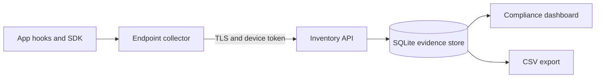

# EdgeDisco

Privacy-preserving endpoint discovery for local AI applications, agent frameworks, and MCP servers.

EdgeDisco is an open-source project created and owned by [Neeraj Sabharwal](https://www.linkedin.com/in/neerajsabharwal/). It is licensed under the GNU Affero General Public License v3.0.

EdgeDisco runs a lightweight collector on macOS, Windows, or Linux and sends sanitized inventory and agent lifecycle evidence to a central compliance dashboard. It answers two enterprise questions: **which AI tools are present, and which agents are actually running inside them?**

> Status: pilot-ready MVP. Review the [production hardening checklist](docs/production-hardening.md) before a broad enterprise rollout.

## Why this exists

AI applications are being installed and executed faster than security teams can inventory them. Traditional software inventory can identify installed applications, but often misses local model runtimes, Python or Node agent frameworks, and MCP servers configured inside developer tools.

This project provides a focused inventory layer without collecting employee content.

## Capabilities

- Discovers supported AI desktop applications and local model runtimes
- Finds supported agent CLIs in a small allowlist of standard executable directories
- Computes SHA-256 content fingerprints for readable binaries already found in safe install roots
- Detects supported AI and agent processes while they are running
- Links active agent runtimes to the desktop tool that spawned them using local process lineage
- Captures agent sessions, subagents, tool use, MCP use, status, model, and duration through native app hooks
- Includes adapters for Cursor, Claude Code, and GitHub Copilot plus a generic Python SDK
- Inventories MCP server names, transport types, and executable basenames
- Records first seen, last seen, device, OS, vendor, type, and running state
- Provides a centralized dashboard and CSV evidence export
- Exposes sanitized compliance inventory through an optional read-only MCP server
- Uses unique device upload credentials after enrollment
- Works without third-party Python runtime dependencies

Current signatures include ChatGPT, Claude, Cursor, GitHub Copilot, Windsurf, Ollama, LM Studio, Jan, AnythingLLM, Open WebUI, LocalAI, Dify, CrewAI, AutoGen, LangGraph/LangChain, MCP servers, and commonly used agent CLIs such as Claude Code, OpenAI Codex, Gemini CLI, Cursor Agent, Cline, Aider, OpenCode, Goose, Continue, Kiro CLI, Amp, Qwen Code, and SWE-agent.

Discovery is targeted rather than a full filesystem crawl. It checks standard application directories, exact supported executable names in bounded executable directories, supported MCP configuration files, and processes selected by the operating system for the current user. See the [detection catalog](docs/detection-catalog.md) for evidence semantics, limitations, and the official sources used for CLI signatures.

For active agent runtimes, the inventory reports the framework, host application, runtime executable, relationship, and aggregated instance count. Native hook adapters add session and tool lifecycle evidence without sending hook payloads, process IDs, prompts, responses, code, tool arguments, or raw commands.

## Privacy boundary

The collector records inventory metadata. It does **not** collect:

- Prompts, responses, documents, clipboard contents, or keystrokes
- Screenshots, browser history, web page contents, or network payloads
- Environment variable values, API keys, authorization headers, or cookies
- MCP arguments, environment values, headers, or remote URLs
- Full executable paths or raw command lines

Paths and sanitized command structures are converted to SHA-256 fingerprints on the endpoint. Readable executables in approved install roots receive a separate SHA-256 content digest for version and integrity comparison. Binary contents are never uploaded, and unknown processes are ignored by default. See [Binary fingerprinting](docs/fingerprinting.md) for the distinction and limitations.

## Architecture



The shared enrollment credential is used only to create a device identity. Each enrolled endpoint receives a unique upload token. Endpoint credentials cannot read fleet inventory. A separate administrator token protects the dashboard and export APIs.

See [Architecture](docs/architecture.md) for the data flow and trust boundaries.

## Requirements

- Python 3.9 or newer
- Python 3.10 or newer for the optional MCP server
- macOS, Windows, or Linux
- Ordinary permission to list the current user's processes
- HTTPS ingress for any non-local deployment

## Self-service install on macOS

The recommended installer creates an isolated environment under `~/.edgedisco`, generates and stores the required credentials, enrolls the Mac, installs adapters for detected AI applications, starts the server and collector at login, and opens the dashboard. It does not use `sudo` or request Full Disk Access, Accessibility, Automation, Screen Recording, or Input Monitoring.

### Tester quick start

Download and inspect the installer, then run it:

```bash
curl -fsSLO https://raw.githubusercontent.com/edgedisco/edgedisco/main/install.sh
less install.sh
bash install.sh
```

For a disposable evaluation Mac, the shorter curl-pipe form is available after reviewing the source:

```bash
/bin/bash -c "$(curl -fsSL https://raw.githubusercontent.com/edgedisco/edgedisco/main/install.sh)"
```

No `sudo` is required. When setup finishes, the terminal prints the local dashboard address. The administrator token remains in the protected local configuration file for manual sign-in if needed.

Open a new Terminal window and run `edgedisco demo`. The browser opens the local dashboard already signed in and shows **DEMO LAB · SIMULATED TEST WORKLOADS** evidence for CrewAI, AutoGen, LangGraph/LangChain, and MCP Server. macOS may display its normal Background Items notification for the per-user services; EdgeDisco does not bypass that platform notice.

If automatic sign-in is unavailable and the dashboard asks for the admin token, copy it without displaying it:

```bash
grep '^export AAI_ADMIN_TOKEN=' ~/.edgedisco/server.env | cut -d= -f2- | tr -d '\n' | pbcopy
```

Paste with **Command+V**. Keep the token private: it grants administrative access to the local EdgeDisco server. Never include it in GitHub issues, logs, screenshots, chat, or bug reports.

The installer creates a stable `edgedisco` command for normal Terminal sessions (no venv activation and no repository checkout). Open a new Terminal window after install, then:

```bash
edgedisco status
edgedisco demo
```

If `demo` is missing, open a new Terminal window and check `command -v edgedisco` and `edgedisco --help`. The command should resolve to the EdgeDisco managed launcher and the help should list `demo`. Rerun the installer to upgrade or repair an older installation; it preserves local evidence and credentials. An active project virtual environment can shadow the managed command. The installer names the conflicting executable when it detects one. Use a fresh Terminal or run `~/.local/bin/edgedisco demo` directly; EdgeDisco does not alter project virtual environments.

The administrator token is stored in `~/.edgedisco/server.env`. Use the clipboard command in the tester quick start whenever the dashboard asks for it.

Rerun the same installer command to upgrade or repair an incomplete installation. Remove the background services while retaining local evidence with:

```bash
edgedisco uninstall
```

Add `--purge` only when you also want to delete credentials, logs, configuration, and collected evidence. See the [macOS self-service guide](docs/deployment-macos.md) for testing and troubleshooting.

## Try the EdgeDisco Demo

See Edge Discovery in action without API keys, paid LLMs, Docker, or network access.

**After macOS self-service install** (no repo checkout, no development venv):

```bash
edgedisco demo
```

**From a source checkout** (development environment):

```bash
python3 -m venv .venv
. .venv/bin/activate
python -m pip install -e .
edgedisco demo
```

The demo starts **SIMULATED TEST WORKLOADS** — lightweight local fixture processes that expose AI runtime signatures. Discovery is performed by the **real** EdgeDisco detector (`collect_inventory()`), not hardcoded output. Metadata-only evidence is sent through the local report API and displayed in the existing dashboard, which opens automatically with a local browser session. Demo records are labeled **DEMO LAB** and show the fixtures as stopped after the run. No prompts, responses, credentials, or raw command lines are collected. Fixture processes are always cleaned up when the demo finishes. Manual administrator-token sign-in remains available if automatic sign-in fails.

## Developer setup from source

Clone the repository and create an isolated environment:

```bash
git clone https://github.com/edgedisco/edgedisco.git
cd edgedisco
python3 -m venv .venv
. .venv/bin/activate
python -m pip install -e .
```

This editable install registers the `edgedisco` (and `ai-inventory`) console scripts on your PATH **only while the virtual environment is active**. Without activating `.venv`, use `.venv/bin/edgedisco` instead. After the macOS self-service install, a normal Terminal can run `edgedisco` without activating any development venv.

Generate two different server credentials:

```bash
export AAI_ADMIN_TOKEN="$(python -c 'import secrets; print(secrets.token_urlsafe(32))')"
export AAI_ENROLLMENT_TOKEN="$(python -c 'import secrets; print(secrets.token_urlsafe(32))')"

umask 077
printf 'export AAI_ADMIN_TOKEN=%s\nexport AAI_ENROLLMENT_TOKEN=%s\n' \
  "$AAI_ADMIN_TOKEN" "$AAI_ENROLLMENT_TOKEN" > server.env

echo "Dashboard admin token: $AAI_ADMIN_TOKEN"
```

Start the central server:

```bash
ai-inventory server --host 127.0.0.1 --port 8080 --db data/inventory.db
```

Open `http://127.0.0.1:8080` and sign in with `AAI_ADMIN_TOKEN`.

The server refuses credentials shorter than 24 characters or identical administrator and enrollment credentials.

## Configure an endpoint

In a second terminal, load the same enrollment credential and create the endpoint configuration:

```bash
cd edgedisco
. .venv/bin/activate
source server.env
cat > agent.json <<EOF
{
  "server_url": "http://127.0.0.1:8080",
  "enrollment_token": "$AAI_ENROLLMENT_TOKEN",
  "scan_interval_seconds": 300,
  "process_poll_interval_seconds": 60,
  "static_scan_interval_seconds": 900
}
EOF
chmod 600 agent.json
```

Preview, enroll, and send the first report:

```bash
ai-inventory agent scan --config agent.json
ai-inventory agent enroll --config agent.json
ai-inventory agent send --config agent.json
```

Install runtime adapters for the apps present on the endpoint:

```bash
ai-inventory adapters install --config "$(pwd)/agent.json" \
  --apps cursor claude-code github-copilot
```

Restart or reload the relevant application, run an agent task, then send the captured runtime events:

```bash
ai-inventory agent send --config agent.json
```

For continuous inventory and runtime-event forwarding:

```bash
ai-inventory agent run --config agent.json
```

The long-running collector checks the lightweight current-user process snapshot every 60 seconds, uploads immediately when inventory changes, and sends a five-minute heartbeat when it does not. Installed applications, CLI entry points, binary hashes, and MCP configuration are cached for up to 15 minutes and refreshed sooner when bounded filesystem metadata changes. See [Scanning performance](docs/scanning-performance.md) for tuning and event-driven design options.

After enrollment, the shared enrollment credential is removed from the configuration and replaced with a unique `device_id` and `device_token`.

See [Runtime adapters](docs/runtime-adapters.md) for app-specific details and the generic SDK.

## Managed deployment

For self-service testing and managed macOS deployment guidance, see [Deploy on macOS](docs/deployment-macos.md).

Other deployment assets:

- Linux per-user systemd unit: `deploy/ai-inventory-agent.service`
- Windows current-user configuration helper: `deploy/install-agent.ps1`

Collectors must run in the target user's session. A root daemon or Windows LocalSystem service inventories the service account rather than the person running local agents and is not a supported deployment model.

## Container deployment

```bash
export AAI_ADMIN_TOKEN="replace-with-a-long-random-value"
export AAI_ENROLLMENT_TOKEN="replace-with-a-different-long-random-value"
docker compose up --build -d
```

The included Compose configuration binds the server to localhost. Put it behind an HTTPS reverse proxy or load balancer before endpoints connect over a network.

## API

| Method | Path | Credential | Purpose |
| --- | --- | --- | --- |
| `POST` | `/api/v1/enroll` | Enrollment token | Create a device identity |
| `POST` | `/api/v1/reports` | Device token | Upload sanitized inventory |
| `POST` | `/api/v1/runtime-events` | Device token | Upload sanitized agent lifecycle events |
| `GET` | `/api/v1/summary` | Admin token or session | Read fleet inventory |
| `GET` | `/api/v1/export.csv` | Admin token or session | Export compliance evidence |
| `GET` | `/api/v1/agent-sessions.csv` | Admin token or session | Export agent-session evidence |
| `GET` | `/healthz` | None | Health check |

For API access, pass `Authorization: Bearer <token>`.

## Read-only MCP server

EdgeDisco can expose its centralized compliance inventory to MCP clients. The MCP component is optional so endpoint collectors can continue to run on Python 3.9. The MCP server uses the official MCP Python SDK and requires Python 3.10 or newer.

Install the MCP extra from a source checkout:

```bash
python3.11 -m venv .mcp-venv
. .mcp-venv/bin/activate
python -m pip install '.[mcp]'
```

Start the MCP server against the local EdgeDisco evidence database:

```bash
edgedisco mcp \
  --db ~/.edgedisco/data/inventory.db \
  --host 127.0.0.1 \
  --port 8081
```

The Streamable HTTP endpoint is:

```text
http://127.0.0.1:8081/mcp
```

Available tools:

| Tool | Purpose |
| --- | --- |
| `get_compliance_summary` | Return fleet counts for devices, assets, agents, sessions, and MCP servers |
| `list_devices` | List enrolled endpoint metadata |
| `list_ai_assets` | List sanitized AI application and runtime inventory |
| `list_running_agents` | List currently observed agent runtimes |
| `list_agent_sessions` | List sanitized agent lifecycle evidence |
| `list_mcp_servers` | List discovered MCP servers without arguments or secrets |

Every tool call is written to `~/.edgedisco/data/mcp-audit.jsonl`. Results are capped at 500 records. The tools do not return prompts, responses, code, credentials, environment values, raw commands, tool arguments, path hashes, command hashes, or user and workspace hashes.

### Test MCP with the Inspector

The current MCP Inspector requires Node.js 22.19 or newer:

```bash
node --version
npx @modelcontextprotocol/inspector \
  --server-url http://127.0.0.1:8081/mcp \
  --transport http
```

List tools from the command line:

```bash
npx @modelcontextprotocol/inspector --cli \
  http://127.0.0.1:8081/mcp \
  --transport http \
  --method tools/list \
  --format json
```

Call the compliance summary:

```bash
npx @modelcontextprotocol/inspector --cli \
  http://127.0.0.1:8081/mcp \
  --transport http \
  --method tools/call \
  --tool-name get_compliance_summary \
  --format json
```

The built-in MCP listener deliberately refuses non-localhost binding. For remote access, keep EdgeDisco bound to localhost and place it behind an authenticated HTTPS reverse proxy or API gateway that implements OAuth 2.1 bearer-token validation. Do not expose port 8081 directly to a network.

## Development

Run the complete local checks from a source checkout before modifying an installed system:

```bash
make check
```

`make check` runs the tests, Python 3.9 syntax validation, bytecode compilation, and shell syntax checks. `make test` runs only the test suite. Both targets configure the `src/` import path for you. Running `python3 -m unittest discover -s tests -v` against Homebrew Python **without** installing the package fails with `ModuleNotFoundError: No module named 'ai_asset_inventory'` because this project uses a `src/` layout. After `python -m pip install -e .` in the project venv, the same unittest command works because the package is installed into that environment.

### Test an unpushed change through the macOS installer

Use the developer environment for isolated regression tests, but use an **installer-managed installation** for final macOS upgrade/end-to-end verification. An editable install does not exercise package replacement, configuration migration, rollback, or real LaunchAgents.

If EdgeDisco was previously installed with the quick installer, keep that installation in place. From the checkout containing the changes, run:

```bash
make check
bash ./install.sh --yes --no-open
edgedisco status
edgedisco demo
```

Running `./install.sh` by path makes the installer package the current checkout, including commits and uncommitted files; it does not download GitHub `main`. Conversely, piping or downloading the installer from GitHub tests the published branch and cannot test an unpushed change. If the existing installation uses a custom root, pass the same value for the upgrade:

```bash
EDGEDISCO_HOME=/existing/installation/root bash ./install.sh --yes --no-open
```

The installer validates the existing configuration and database, stops the LaunchAgents, creates a protected snapshot under the installation's `backups/` directory, upgrades the managed virtual environment, migrates supported configuration versions without replacing custom settings or enrollment, and verifies the restarted services. A failed upgrade automatically attempts to restore the snapshot. Do not uninstall or purge the existing installation before this test; doing so would bypass the upgrade and migration paths.

Confirm migration without printing credentials:

```bash
python3 - <<'PY'
import json
from pathlib import Path

root = Path.home() / ".edgedisco"  # Match EDGEDISCO_HOME when customized.
config = json.loads((root / "agent.json").read_text())
print({
    "config_version": config.get("config_version"),
    "server_url": config.get("server_url"),
    "has_device_token": bool(config.get("device_token")),
    "process_poll_interval_seconds": config.get("process_poll_interval_seconds"),
    "static_scan_interval_seconds": config.get("static_scan_interval_seconds"),
})
PY
```

Also verify that the dashboard contains fresh inventory, that starting and stopping a supported agent changes process evidence after a polling interval, and that a new session in a hooked application creates runtime events and session state. Demo or SDK events verify transport but do not prove native application-hook invocation. The test should not require Full Disk Access, Accessibility, Screen Recording, or other new macOS privacy permissions; investigate an unexpected prompt instead of granting it.

See the [full installed-system checklist and recovery instructions](docs/deployment-macos.md#final-installed-system-test). Dashboard JavaScript tests run automatically when Node is available.

Build a wheel:

```bash
make build
```

The GitHub Actions workflow installs the package, then runs the test suite on Python 3.9 through 3.13 against the installed distribution. See [CONTRIBUTING.md](CONTRIBUTING.md) before submitting changes.

## Current limitations

- Ordinary browser-tab usage is not detected. That requires an approved browser extension, DNS/SWG telemetry, or browser-management integration.
- Agents that execute entirely inside a SaaS control plane are not visible to endpoint hooks and require that platform's audit or inventory API.
- The central server uses SQLite and one administrator role.
- The built-in MCP listener is localhost-only; production remote MCP authentication must be supplied by an HTTPS proxy or API gateway.
- Automated retention, device-token revocation, and SSO are not implemented.
- Detection is signature-based and should be aligned with the organization's approved and prohibited application catalog.
- A native signed installer is not included; the macOS self-service installer is a reviewable shell script.

## Responsible deployment

Before installing on employee devices:

- Review collected fields with Security, Privacy, Legal, HR, and employee representatives.
- Publish an employee notice describing the purpose, collected metadata, access controls, and retention period.
- Use HTTPS, protect configuration files, rotate enrollment credentials, and restrict dashboard access.
- Complete the [production hardening checklist](docs/production-hardening.md).

## Security

See [SECURITY.md](SECURITY.md) for the security model and private reporting guidance.

## Ownership and license

Copyright © 2026 [Neeraj Sabharwal](https://www.linkedin.com/in/neerajsabharwal/).

EdgeDisco is licensed under the [GNU Affero General Public License v3.0](LICENSE). Modified versions made available over a network must also make their corresponding source code available under the same license.
