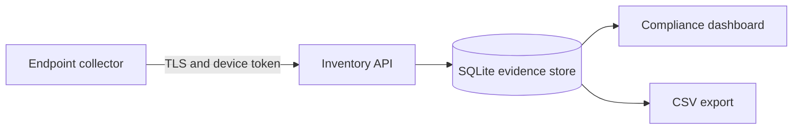

# EdgeDisco

Privacy-preserving endpoint discovery for local AI applications, agent frameworks, and MCP servers.

AI Asset Inventory runs a lightweight collector on macOS, Windows, or Linux and sends sanitized inventory to a central compliance dashboard. It is designed to answer a basic enterprise question: **which AI tools and agents are present or running on company endpoints?**

> Status: pilot-ready MVP. Review the [production hardening checklist](docs/production-hardening.md) before a broad enterprise rollout.

## Why this exists

AI applications are being installed and executed faster than security teams can inventory them. Traditional software inventory can identify installed applications, but often misses local model runtimes, Python or Node agent frameworks, and MCP servers configured inside developer tools.

This project provides a focused inventory layer without collecting employee content.

## Capabilities

- Discovers supported AI desktop applications and local model runtimes
- Detects supported AI and agent processes while they are running
- Links active agent runtimes to the desktop tool that spawned them using local process lineage
- Inventories MCP server names, transport types, and executable basenames
- Records first seen, last seen, device, OS, vendor, type, and running state
- Provides a centralized dashboard and CSV evidence export
- Uses unique device upload credentials after enrollment
- Works without third-party Python runtime dependencies

Current signatures include ChatGPT, Claude, Cursor, GitHub Copilot, Windsurf, Ollama, LM Studio, Jan, AnythingLLM, Open WebUI, LocalAI, Dify, CrewAI, AutoGen, LangGraph/LangChain, and MCP servers.

For active agent runtimes, the inventory reports the framework, host application, runtime executable, relationship, and aggregated instance count. It does not send process IDs or raw arguments.

## Privacy boundary

The collector records inventory metadata. It does **not** collect:

- Prompts, responses, documents, clipboard contents, or keystrokes
- Screenshots, browser history, web page contents, or network payloads
- Environment variable values, API keys, authorization headers, or cookies
- MCP arguments, environment values, headers, or remote URLs
- Full executable paths or raw command lines

Paths and sanitized command structures are converted to SHA-256 fingerprints on the endpoint. Unknown processes are ignored by default.

## Architecture



The shared enrollment credential is used only to create a device identity. Each enrolled endpoint receives a unique upload token. Endpoint credentials cannot read fleet inventory. A separate administrator token protects the dashboard and export APIs.

See [Architecture](docs/architecture.md) for the data flow and trust boundaries.

## Requirements

- Python 3.9 or newer
- macOS, Windows, or Linux
- Permission to list local processes
- HTTPS ingress for any non-local deployment

## Quick start from source

Clone the repository and create an isolated environment:

```bash
git clone https://github.com/nsabharwal/edgedisco.git
cd edgedisco
python3 -m venv .venv
. .venv/bin/activate
python -m pip install .
```

Generate two different server credentials:

```bash
export AAI_ADMIN_TOKEN="$(python -c 'import secrets; print(secrets.token_urlsafe(32))')"
export AAI_ENROLLMENT_TOKEN="$(python -c 'import secrets; print(secrets.token_urlsafe(32))')"
```

Start the central server:

```bash
ai-inventory server --host 127.0.0.1 --port 8080 --db data/inventory.db
```

Open `http://127.0.0.1:8080` and sign in with `AAI_ADMIN_TOKEN`.

The server refuses credentials shorter than 24 characters or identical administrator and enrollment credentials.

## Configure an endpoint

Copy the example configuration:

```bash
cp config/agent.example.json agent.json
chmod 600 agent.json
```

Update `server_url` and `enrollment_token`, then preview the local inventory:

```bash
ai-inventory agent scan --config agent.json
```

Inspect the JSON before uploading anything. Then enroll and begin continuous collection:

```bash
ai-inventory agent enroll --config agent.json
ai-inventory agent run --config agent.json
```

After enrollment, the shared enrollment credential is removed from the configuration and replaced with a unique `device_id` and `device_token`.

## macOS deployment

For a complete local installation, background service setup, verification, logs, and removal instructions, see [Deploy on macOS](docs/deployment-macos.md).

Other deployment assets:

- Linux systemd unit: `deploy/ai-inventory-agent.service`
- Windows configuration helper: `deploy/install-agent.ps1`
- macOS LaunchDaemon example: `deploy/com.trust3.ai-inventory.plist`

## Container deployment

```bash
export AAI_ADMIN_TOKEN="replace-with-a-long-random-value"
export AAI_ENROLLMENT_TOKEN="replace-with-a-different-long-random-value"
docker compose up --build -d
```

The included Compose configuration binds the server to localhost. Put it behind an HTTPS reverse proxy or load balancer before endpoints connect over a network.

## API

| Method | Path | Credential | Purpose |
| --- | --- | --- | --- |
| `POST` | `/api/v1/enroll` | Enrollment token | Create a device identity |
| `POST` | `/api/v1/reports` | Device token | Upload sanitized inventory |
| `GET` | `/api/v1/summary` | Admin token or session | Read fleet inventory |
| `GET` | `/api/v1/export.csv` | Admin token or session | Export compliance evidence |
| `GET` | `/healthz` | None | Health check |

For API access, pass `Authorization: Bearer <token>`.

## Development

Run the automated tests:

```bash
make test
```

Build a wheel:

```bash
make build
```

The GitHub Actions workflow runs the test suite on Python 3.9 through 3.13. See [CONTRIBUTING.md](CONTRIBUTING.md) before submitting changes.

## Current limitations

- Ordinary browser-tab usage is not detected. That requires an approved browser extension, DNS/SWG telemetry, or browser-management integration.
- Agents that execute entirely inside a SaaS control plane are not visible to an endpoint process collector and require that platform's audit or inventory API.
- The central server uses SQLite and one administrator role.
- Automated retention, device-token revocation, and SSO are not implemented.
- Detection is signature-based and should be aligned with the organization's approved and prohibited application catalog.
- Native signed installers are not included in this MVP.

## Responsible deployment

Before installing on employee devices:

- Review collected fields with Security, Privacy, Legal, HR, and employee representatives.
- Publish an employee notice describing the purpose, collected metadata, access controls, and retention period.
- Use HTTPS, protect configuration files, rotate enrollment credentials, and restrict dashboard access.
- Complete the [production hardening checklist](docs/production-hardening.md).

## Security

See [SECURITY.md](SECURITY.md) for the security model and private reporting guidance.

## License

Apache License 2.0. See [LICENSE](LICENSE).
