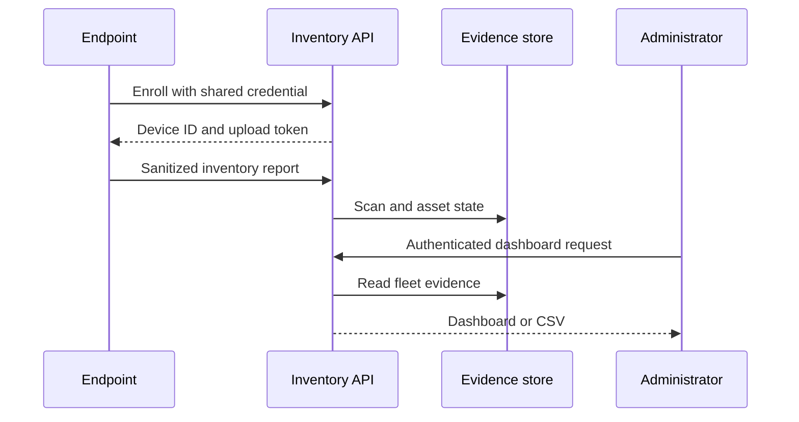

# Architecture

## Components

### Endpoint collector

The collector performs an allowlisted scan of local process metadata, parent-child process lineage, installed application metadata, and supported MCP configuration locations. It links recognized agent runtimes to the AI tool that spawned them and aggregates concurrent instances. It converts sensitive location and command information into fingerprints before constructing a report.

### Enrollment API

An operator temporarily provides a shared enrollment credential to a new endpoint. The server returns a random device ID and device-specific upload token. The collector atomically rewrites its configuration with restrictive file permissions and removes the enrollment credential.

### Inventory API

An enrolled endpoint can upload reports using its device token. Device tokens cannot access dashboard, summary, or export endpoints. Tokens are stored as SHA-256 hashes because the generated token has high entropy.

### Evidence store

The MVP uses SQLite in WAL mode. It stores device records, immutable scan headers, and the current plus first-seen/last-seen state for each asset fingerprint.

### Dashboard and export

Administrators authenticate with a separate credential. The dashboard shows fleet totals and asset evidence. CSV export provides a portable snapshot for audit or SIEM ingestion.

## Data flow

## Collected fields

| Category | Fields | Treatment |
| --- | --- | --- |
| Device | Hostname, OS, OS version, architecture, agent version | Sent as metadata |
| Asset | Name, vendor, type, version, running state | Sent as metadata |
| Time | Observed, received, first seen, last seen | Stored as UTC timestamps |
| Path | Executable or configuration location | SHA-256 fingerprint only |
| Command | Sanitized command structure | SHA-256 fingerprint only |
| MCP | Server name, owner application, transport, executable basename | Arguments, environment, headers, and URLs excluded |
| Agent runtime | Framework, host app, runtime basename, relationship, instance count | Process IDs and raw arguments excluded |

## Trust boundaries

- Endpoint reports are authenticated but remain untrusted input.
- The API validates shape, field presence, types, and asset count.
- TLS termination is required outside localhost.
- Administrator access is independent from endpoint upload access.
- The database and backups contain compliance evidence and require restricted access.
