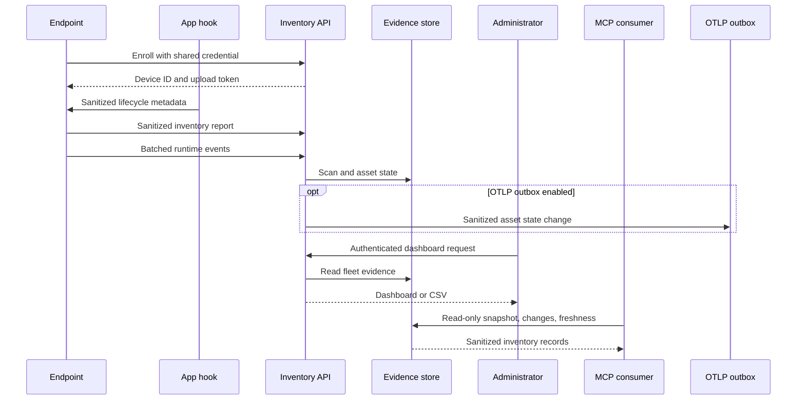

# Architecture

## Components

### Endpoint collector

The collector performs an allowlisted scan of installed application metadata, exact supported CLI entry points, supported editor-extension metadata in standard per-user locations, operating-system-selected current-user process metadata and parent-child lineage, and supported MCP configuration locations. It does not recursively crawl the filesystem or search arbitrary `PATH` entries. Native app hooks write sanitized agent lifecycle events to a locked local spool. The collector forwards inventory and runtime batches independently, allowing hooks to remain fast and fail-open when the network is unavailable.

The long-running collector uses incremental reconciliation. Current-user processes are refreshed on the short polling interval. Installed applications, CLI entry points, binary fingerprints, and MCP configuration are cached, invalidated by bounded path metadata changes, and periodically reconciled in full. Unchanged inventory is not uploaded until the heartbeat interval, while process or static-state changes trigger an immediate full snapshot. Full snapshots preserve disappearance semantics at the server; event notifications or deltas are never the sole source of truth. See [Scanning performance](scanning-performance.md).

An installed-app or CLI observation proves that a supported entry point was present when scanned; it does not prove use. A process observation proves that a matching current-user process was visible during that scan. Process evidence is heuristic and short-lived. Native hooks provide the higher-confidence session and tool lifecycle evidence. The [detection catalog](detection-catalog.md) records the supported signatures and their evidence sources.

For an already-discovered executable inside an approved install root, the collector may compute a bounded SHA-256 content digest. The digest is secondary evidence and never replaces the stable logical asset fingerprint. The packaged static fingerprint library supplies product signatures and can carry version-, platform-, and architecture-specific known binary hashes as maintainers verify releases. An unlisted hash means the artifact is not yet in that library; it is not automatically malicious. See [Binary fingerprinting](fingerprinting.md).

### Runtime adapters

Cursor, Claude Code, and GitHub Copilot adapters merge EdgeDisco commands into their documented hook configuration without removing existing hooks. A generic Python SDK instruments custom runtimes. Adapters normalize each vendor payload locally and discard prompts, responses, code, tool arguments, output, transcript paths, email addresses, and raw workspace paths.

### Enrollment API

An operator temporarily provides a shared enrollment credential to a new endpoint. The server returns a random device ID and device-specific upload token. The collector atomically rewrites its configuration with restrictive file permissions and removes the enrollment credential.

### Inventory API

An enrolled endpoint can upload reports using its device token. Device tokens cannot access dashboard, summary, or export endpoints. Tokens are stored as SHA-256 hashes because the generated token has high entropy.

### Evidence store

The MVP uses SQLite in WAL mode. It stores device records, immutable scan headers, and the current plus first-seen/last-seen state for each asset fingerprint.

### Dashboard and export

Administrators authenticate with a separate credential. The dashboard shows fleet totals and asset evidence. Separate asset, aggregated-session, and runtime-event CSV exports provide portable evidence for audit or SIEM ingestion. Their fixed schemas flatten only allowlisted metadata, retain pseudonymous hashes needed for correlation, neutralize spreadsheet formula prefixes, and exclude raw paths, identities, command lines, prompts, responses, and arbitrary metadata.

Local macOS setup opens a fresh, single-use browser bootstrap URL to establish an administrator session; the administrator token is never placed in that URL. Opening the plain dashboard later without a valid session still requires sign-in.

### MCP inventory service

The optional MCP server is a separate read-only process over Streamable HTTP. It binds to loopback,
offers bounded interactive queries, and provides a watermark snapshot plus ordered change feed for
complete inventory synchronization. Asset state changes and per-device inventory freshness are
separate contracts so unchanged endpoints do not create an upsert for every asset on every scan.
MCP configuration records use a dedicated sanitized projection; tool arguments, credentials,
environment values, headers, URLs, and raw paths are excluded. See
[MCP inventory access and synchronization](inventory-sync-mcp.md).

### OpenTelemetry projection

When explicitly enabled, accepted inventory snapshots also pass through a stricter recognized-asset
projection into a bounded SQLite outbox. The projection records state changes for applications,
processes, and agent runtimes and the encoder produces OTLP Logs protobuf. Inventory observation
time and server receipt time are retained separately. No exporter or collector network delivery is
implemented yet. See [OpenTelemetry integration design](otel-integration.md).

Runtime spool uploads are serialized independently of hook writers. Files are sent in bounded batches and retained until all batches succeed. Failed uploads replay the same event IDs, which the server deduplicates. Inventory snapshots and session state use observation timestamps rather than arrival order; older snapshots retain their scan headers without replacing current state.

Running inventory requires a current snapshot received within 15 minutes. Runtime hook uploads alone do not refresh that inventory. The dashboard marks expired inventory as stale, and the asset CSV exposes a separate `stale` column. All three CSV exports include all records, independently of the dashboard's 500-row display cap. OTLP projection includes stopped assets after snapshot reconciliation.

Inventory timestamps more than five minutes ahead of server time are rejected. Previously accepted future-dated scan headers outside that tolerance do not block current reconciliation or establish freshness. A failed process query suppresses the complete report rather than implying every process stopped.

The dashboard groups evidence by product and device, initially collapsed, with device/type/status/source filters. Evidence counts are not process counts: application records, executable-path process records, and inferred runtime groups can describe the same software. Runtime groups include an observed instance count; raw PIDs are not persisted. Historical records remain available. Session rows are a separate projection of delivered hook/SDK lifecycle events, never inferred from process presence.

## Data flow

## Collected fields

| Category | Fields | Treatment |
| --- | --- | --- |
| Device | Hostname, OS, OS version, architecture, agent version | Sent as metadata |
| Asset | Name, vendor, type, version, running state | Sent as metadata |
| Time | Observed, received, first seen, last seen | Stored as UTC timestamps |
| Path | Executable or configuration location | SHA-256 fingerprint only |
| Command | Sanitized command structure | SHA-256 fingerprint only |
| Executable content | SHA-256 of an allowlisted regular file, catalog status and library version | Binary bytes are not uploaded; protected and out-of-scope paths are not opened |
| MCP | Server name, owner application, transport, executable basename | Arguments, environment, headers, and URLs excluded |
| Agent runtime | Framework, host app, runtime basename, relationship, instance count | Process IDs and raw arguments excluded |
| Agent session | App, hashed session and agent IDs, agent type, model, status, duration | Prompt, response, code, transcript, and raw identity excluded |
| Tool event | Tool name, MCP server name, success/failure, duration | Tool input and output excluded |

## Trust boundaries

- Endpoint reports are authenticated but remain untrusted input.
- The API validates shape, field presence, types, and asset count.
- Inventory ingestion rejects unknown fields, arbitrary metadata, invalid hashes, and timestamps without a timezone. Custom collectors must use the supported schema; stored evidence from earlier versions is not retroactively sanitized.
- Runtime ingestion rejects fields outside its explicit metadata allowlist.
- Inventory schema 2 carries optional binary evidence; the server continues to accept schema 1 reports during staged upgrades. Deploy the schema-2-capable server before schema-2 agents in a managed fleet.
- TLS termination is required outside localhost.
- Administrator access is independent from endpoint upload access.
- The database and backups contain compliance evidence and require restricted access.
- macOS collection is per-user and unprivileged. Root LaunchDaemons are intentionally unsupported because they inspect the wrong user and expand privilege without improving coverage.
- Linux self-service collection is also per-user and unprivileged. Supported hosts use `systemd --user` units for the local server and collector. The installer requires an active user manager, refuses root execution, and does not enable lingering; containers, non-systemd systems, and sessions without a user manager use manual deployment.
