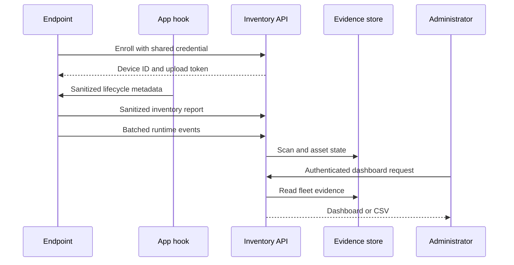

# Architecture

## Components

### Endpoint collector

The collector performs an allowlisted scan of local process metadata, parent-child process lineage, installed application metadata, and supported MCP configuration locations. Native app hooks write sanitized agent lifecycle events to a locked local spool. The collector forwards inventory and runtime batches independently, allowing hooks to remain fast and fail-open when the network is unavailable.

### Runtime adapters

Cursor, Claude Code, and GitHub Copilot adapters merge EdgeDisco commands into their documented hook configuration without removing existing hooks. A generic Python SDK instruments custom runtimes. Adapters normalize each vendor payload locally and discard prompts, responses, code, tool arguments, output, transcript paths, email addresses, and raw workspace paths.

### Enrollment API

An operator temporarily provides a shared enrollment credential to a new endpoint. The server returns a random device ID and device-specific upload token. The collector atomically rewrites its configuration with restrictive file permissions and removes the enrollment credential.

### Inventory API

An enrolled endpoint can upload reports using its device token. Device tokens cannot access dashboard, summary, or export endpoints. Tokens are stored as SHA-256 hashes because the generated token has high entropy.

### Evidence store

The MVP uses SQLite in WAL mode. It stores device records, immutable scan headers, and the current plus first-seen/last-seen state for each asset fingerprint.

### Dashboard and export

Administrators authenticate with a separate credential. The dashboard shows fleet totals and asset evidence. CSV export provides a portable snapshot for audit or SIEM ingestion.

Local macOS setup opens a fresh, single-use browser bootstrap URL to establish an administrator session; the administrator token is never placed in that URL. Opening the plain dashboard later without a valid session still requires sign-in.

Runtime spool uploads are serialized independently of hook writers. Files are sent in bounded batches and retained until all batches succeed. Failed uploads replay the same event IDs, which the server deduplicates. Inventory snapshots and session state use observation timestamps rather than arrival order; older snapshots retain their scan headers without replacing current state.

Running inventory requires a current snapshot received within 15 minutes. Runtime hook uploads alone do not refresh that inventory. The dashboard marks expired inventory as stale, and the asset CSV exposes a separate `stale` column. Both CSV exports include all records, independently of the dashboard's 500-row display cap. OTLP projection includes stopped assets after snapshot reconciliation.

## Data flow

## Collected fields

| Category | Fields | Treatment |
| --- | --- | --- |
| Device | Hostname, OS, OS version, architecture, agent version | Sent as metadata |
| Asset | Name, vendor, type, version, running state | Sent as metadata |
| Time | Observed, received, first seen, last seen | Stored as UTC timestamps |
| Path | Executable or configuration location | SHA-256 fingerprint only |
| Command | Sanitized command structure | SHA-256 fingerprint only |
| MCP | Server name, owner application, transport, executable basename | Arguments, environment, headers, and URLs excluded |
| Agent runtime | Framework, host app, runtime basename, relationship, instance count | Process IDs and raw arguments excluded |
| Agent session | App, hashed session and agent IDs, agent type, model, status, duration | Prompt, response, code, transcript, and raw identity excluded |
| Tool event | Tool name, MCP server name, success/failure, duration | Tool input and output excluded |

## Trust boundaries

- Endpoint reports are authenticated but remain untrusted input.
- The API validates shape, field presence, types, and asset count.
- Inventory ingestion rejects unknown fields, arbitrary metadata, invalid hashes, and timestamps without a timezone. Custom collectors must use the supported schema; stored evidence from earlier versions is not retroactively sanitized.
- Runtime ingestion rejects fields outside its explicit metadata allowlist.
- TLS termination is required outside localhost.
- Administrator access is independent from endpoint upload access.
- The database and backups contain compliance evidence and require restricted access.
