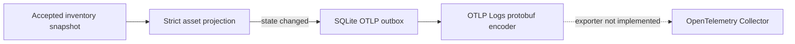

# OpenTelemetry integration design

EdgeDisco currently implements the local half of an OTLP Logs integration. It creates a strict,
privacy-filtered asset state-change event, stores it in a durable SQLite outbox, and can encode the
stored event as an OTLP protobuf `ExportLogsServiceRequest`. It does not yet run an exporter or make
network requests to an OpenTelemetry Collector.

## Current data flow

Set `EDGEDISCO_OTLP_OUTBOX_ENABLED=true` on the inventory server to populate the outbox. Install
`ai-asset-inventory[otlp]` to use the protobuf encoder. Enabling the outbox alone does not deliver
telemetry.

The projection emits `edgedisco.asset.observed` log records for recognized applications,
processes, and agent runtimes. It exports state transitions rather than every heartbeat. The
allowlisted attributes are schema version, observation ID, device ID, asset kind, name, vendor,
optional version, running state, simulation marker, and validated agent host/relationship fields.
MCP configuration is intentionally excluded from OTLP because server names are user-controlled;
the sanitized MCP synchronization feed is available through MCP instead.

Raw paths, path hashes, command hashes, binary hashes, arbitrary metadata, prompts, responses,
credentials, arguments, environment values, and configuration URLs never enter the OTLP outbox.
The encoder validates the stored JSON again before creating protobuf bytes. It maps the endpoint's
inventory observation time to `time_unix_nano` and the server receipt time to
`observed_time_unix_nano`. Queued records from releases before receipt time was stored remain
encodable and use the inventory observation time for both fields.

## Queue behavior

The default queue holds at most 5,000 pending/retry records, 16 MiB of pending/retry JSON, and seven
days of undelivered evidence. A newer state for the same logical asset supersedes its older pending
state. Age, capacity, oversize, and superseded drops increment `dropped_events_total`; status is
available through `Database.otlp_outbox_status()` for future operational surfaces. Local inventory
ingestion continues if projection bookkeeping fails or outbound evidence is dropped.

This is a latest-state delivery design. It does not guarantee delivery of every intermediate
transition when the destination is unavailable. Delivered rows also have no implemented cleanup
policy because the exporter lifecycle is not present yet.

## Exporter requirements

Before calling this a working OpenTelemetry integration, add a supervised exporter that:

1. Claims due `pending` and `retry` rows without allowing concurrent workers to duplicate claims.
2. Posts protobuf to the collector's `/v1/logs` endpoint with
   `Content-Type: application/x-protobuf`, TLS verification, bounded timeouts, and optional
   authentication headers loaded from protected configuration.
3. Treats OTLP partial success as a delivery failure for rejected records, applies bounded
   exponential backoff with jitter to retryable responses, and moves permanent failures to a
   diagnosable terminal state.
4. Recovers in-flight work after a crash, bounds delivered-row retention, and exposes queue age,
   retry, failure, drop, and last-success health without logging payloads or credentials.

Collector endpoint, TLS, authentication, retry, and retention settings need versioned configuration
and migration support. Load-test queue growth and backpressure before enabling delivery across a
fleet. Until that work exists, route production inventory through the MCP snapshot/change feed or
the existing authenticated exports.
