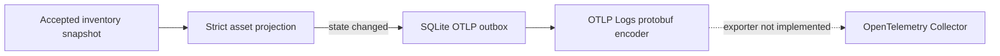
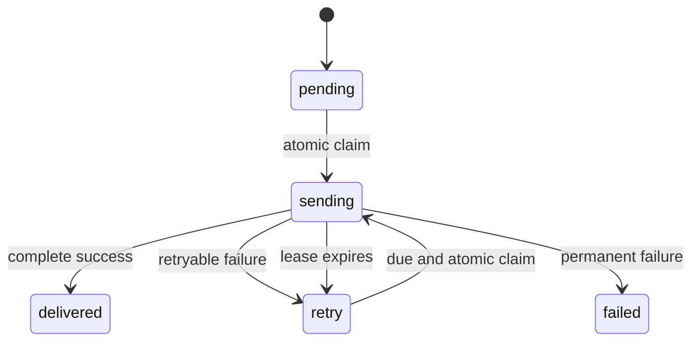

# OpenTelemetry integration design

EdgeDisco currently implements the local half of an OTLP Logs integration. It creates a strict,
privacy-filtered asset state-change event, stores it in a durable SQLite outbox, and can encode the
stored event as an OTLP protobuf `ExportLogsServiceRequest`. It does not yet run an exporter or make
network requests to an OpenTelemetry Collector.

## Current data flow



Set `EDGEDISCO_OTLP_OUTBOX_ENABLED=true` on the inventory server to populate the outbox. Install
`ai-asset-inventory[otlp]` to use the protobuf encoder. Enabling the outbox alone does not deliver
telemetry.

The projection emits `edgedisco.asset.observed` log records for recognized applications,
processes, and agent runtimes. It exports state transitions rather than every heartbeat. The
allowlisted attributes are schema version, observation ID, device ID, asset kind, name, vendor,
optional version, running state, simulation marker, and validated agent host/relationship fields.
MCP configuration is intentionally excluded from OTLP because server names are user-controlled;
the sanitized MCP synchronization feed is available through MCP instead.

Raw paths, path hashes, command hashes, binary hashes, arbitrary metadata, prompts, responses,
credentials, arguments, environment values, and configuration URLs never enter the OTLP outbox.
The encoder validates the stored JSON again before creating protobuf bytes. It maps the endpoint's
inventory observation time to `time_unix_nano` and the server receipt time to
`observed_time_unix_nano`. Queued records from releases before receipt time was stored remain
encodable and use the inventory observation time for both fields.

## Queue behavior

The default queue holds at most 5,000 pending/retry records, 16 MiB of pending/retry JSON, and seven
days of undelivered evidence. A newer state for the same logical asset supersedes its older pending
state. Age, capacity, oversize, and superseded drops increment `dropped_events_total`; status is
available through `Database.otlp_outbox_status()` for future operational surfaces. Local inventory
ingestion continues if projection bookkeeping fails or outbound evidence is dropped.

This is a latest-state delivery design. It does not guarantee delivery of every intermediate
transition when the destination is unavailable. Delivered rows also have no implemented cleanup
policy because the exporter lifecycle is not present yet.

## Exporter specification

### Scope and process model

The first exporter release supports OTLP Logs over HTTP with binary protobuf. JSON and OTLP/gRPC
are outside the first release. Export runs as a separately supervised process:

```text
edgedisco otlp-export --db /path/to/inventory.db
```

Keeping delivery separate from the inventory HTTP server prevents collector latency, TLS failures,
and exporter restarts from delaying inventory ingestion. A managed installation adds the exporter
service only when delivery is enabled. Multiple exporter processes may point at the same database;
the lease protocol below ensures that each row has one active owner.

Outbox creation and network delivery are separate switches. This permits validation of projected
events before allowing egress:

```dotenv
EDGEDISCO_OTLP_OUTBOX_ENABLED=true
EDGEDISCO_OTLP_EXPORT_ENABLED=true
OTEL_EXPORTER_OTLP_LOGS_ENDPOINT=https://collector.example.com/v1/logs
OTEL_EXPORTER_OTLP_LOGS_PROTOCOL=http/protobuf
```

`EDGEDISCO_OTLP_EXPORT_ENABLED=true` requires `EDGEDISCO_OTLP_OUTBOX_ENABLED=true` and an explicit
endpoint. EdgeDisco must not silently use the OpenTelemetry SDK default of localhost because an
operator should make telemetry egress deliberate.

### Configuration contract

Use the standard OpenTelemetry exporter variable names wherever the OpenTelemetry specification
defines one. Signal-specific variables take precedence over their general equivalents.

| Setting | Default | Contract |
| --- | --- | --- |
| `EDGEDISCO_OTLP_OUTBOX_ENABLED` | `false` | Project state changes into the durable outbox. |
| `EDGEDISCO_OTLP_EXPORT_ENABLED` | `false` | Start network delivery. Requires the outbox and an endpoint. |
| `OTEL_EXPORTER_OTLP_LOGS_ENDPOINT` | unset | Exact Logs URL. No path is appended. |
| `OTEL_EXPORTER_OTLP_ENDPOINT` | unset | Base URL; append `/v1/logs`, preserving any path prefix. |
| `OTEL_EXPORTER_OTLP_LOGS_PROTOCOL` | `http/protobuf` | Must be `http/protobuf` in the first release. |
| `OTEL_EXPORTER_OTLP_PROTOCOL` | `http/protobuf` | General protocol, used only when the Logs protocol is unset. |
| `OTEL_EXPORTER_OTLP_LOGS_HEADERS` | unset | Comma-separated `key=value` request headers. |
| `OTEL_EXPORTER_OTLP_HEADERS` | unset | General headers, used only when Logs headers are unset. |
| `OTEL_EXPORTER_OTLP_LOGS_TIMEOUT` | `10000` | Whole-request timeout in milliseconds. |
| `OTEL_EXPORTER_OTLP_TIMEOUT` | `10000` | General timeout, used only when the Logs timeout is unset. |
| `OTEL_EXPORTER_OTLP_LOGS_COMPRESSION` | unset | `gzip` or no compression. |
| `OTEL_EXPORTER_OTLP_COMPRESSION` | unset | General compression, used only when Logs compression is unset. |
| `OTEL_EXPORTER_OTLP_LOGS_CERTIFICATE` | system trust | PEM CA certificate path for server verification. |
| `OTEL_EXPORTER_OTLP_CERTIFICATE` | system trust | General CA path, used only when the Logs CA is unset. |
| `OTEL_EXPORTER_OTLP_LOGS_CLIENT_CERTIFICATE` | unset | PEM client certificate path; requires the client key. |
| `OTEL_EXPORTER_OTLP_LOGS_CLIENT_KEY` | unset | PEM client key path; requires the client certificate. |
| `OTEL_EXPORTER_OTLP_CLIENT_CERTIFICATE` | unset | General client certificate, used only when its Logs setting is unset. |
| `OTEL_EXPORTER_OTLP_CLIENT_KEY` | unset | General client key, used only when its Logs setting is unset. |
| `EDGEDISCO_OTLP_BATCH_RECORDS` | `100` | Maximum records claimed per request. Range 1-1000. |
| `EDGEDISCO_OTLP_BATCH_BYTES` | `1048576` | Maximum uncompressed protobuf request size. |
| `EDGEDISCO_OTLP_POLL_INTERVAL_MS` | `1000` | Delay after a scan finds no due work. |
| `EDGEDISCO_OTLP_LEASE_SECONDS` | `60` | Claim lifetime; must exceed the request timeout. |
| `EDGEDISCO_OTLP_SHUTDOWN_GRACE_SECONDS` | `15` | Time allowed for the active request during shutdown. |
| `EDGEDISCO_OTLP_DELIVERED_RETENTION_DAYS` | `1` | Retention for successfully delivered rows. |
| `EDGEDISCO_OTLP_FAILED_RETENTION_DAYS` | `7` | Retention for terminal failure diagnostics. |

The endpoint rules are:

- `OTEL_EXPORTER_OTLP_LOGS_ENDPOINT` is used exactly as configured.
- Otherwise, append `v1/logs` to `OTEL_EXPORTER_OTLP_ENDPOINT`. For example,
  `https://host/otel` becomes `https://host/otel/v1/logs`.
- Reject URLs containing user information, a query, or a fragment. Reject schemes other than
  `https`, except that `http` is allowed for a literal loopback address.
- Do not follow redirects or use ambient HTTP proxy variables. A proxy changes the telemetry trust
  boundary and needs a future explicit setting.

Parse header values according to the OpenTelemetry key/value header format. Reject malformed or
duplicate entries and headers owned by the transport, including `content-type`, `content-length`,
`content-encoding`, `host`, `connection`, and `user-agent`. Never log header values, certificate
contents, private-key paths, or URLs containing credentials.

Configuration is validated before the worker opens the database. Invalid combinations fail startup
with a message naming the setting, but without reproducing a secret value. The worker reloads no
settings at runtime; changing endpoint or credentials requires a supervised restart.

### Durable state and claiming

Rebuild the outbox table during migration to extend its existing `status` check with `sending`, and
add the following nullable columns:

| Column | Meaning |
| --- | --- |
| `lease_id` | Random identifier for the current claim; null outside `sending`. |
| `lease_expires_at` | UTC claim expiry; null outside `sending`. |
| `last_attempt_at` | UTC time at which the most recent HTTP attempt began. |
| `failed_at` | UTC time at which the row entered terminal failure. |
| `last_http_status` | Most recent HTTP status, or null when no response was received. |

Existing `attempt_count`, `next_attempt_at`, `delivered_at`, and `last_error_code` columns remain.
Limit error categories to a fixed enum and never store a response body or rendered request payload.
Extend `otlp_export_status` with cumulative attempted, retried, delivered, and failed event counts,
plus `last_attempt_at`, `last_success_at`, `last_failure_at`, `last_failure_code`, and
`last_http_status`. These aggregates survive row cleanup.

The state machine is:



Claim rows in a short `BEGIN IMMEDIATE` transaction. First recover expired `sending` rows to
`retry`, then select due `pending` and `retry` rows in stable insertion order, limited by record
count and estimated batch bytes. Set one new cryptographically random `lease_id`, `sending`, lease
expiry, attempt count, and `last_attempt_at`, then commit. Perform encoding and network I/O only
after the transaction commits.

Every completion update must match both the row ID and `lease_id`. A worker whose lease expired
cannot overwrite the decision made by a new owner. Extend the lease before a request only when the
remaining lifetime cannot cover the configured request timeout and shutdown grace. Stop claiming
new work on `SIGTERM` or `SIGINT`; allow the active request to finish for the configured grace
period, then leave its rows for lease recovery.

### Encoding and request behavior

Validate each stored projection again and encode one batch as one
`ExportLogsServiceRequest`. A row that cannot be validated or encoded moves to `failed` with an
`invalid_payload` category; valid rows from the same claim continue in a smaller request. Build
batches without exceeding either configured limit. If one valid record exceeds the byte limit,
send it alone subject to the existing outbox hard limit.

POST the request with:

```http
Content-Type: application/x-protobuf
User-Agent: edgedisco/<version>
Content-Encoding: gzip  # only when configured
```

Reuse HTTP connections, verify server certificates and hostnames, and apply the timeout to the
complete request including reading the response. Cap response bodies at 4 MiB. Do not send
cookies. The observation ID remains stable across retries and is the receiver's available
deduplication key; OTLP itself does not provide exactly-once delivery.

### Response and retry policy

Classify each completed request as follows:

| Result | Action |
| --- | --- |
| HTTP 2xx with an empty or valid protobuf response and no rejected records | Mark the batch `delivered`. |
| HTTP 2xx with `partial_success.rejected_log_records > 0` | Mark the batch `failed` as `partial_success`. The protocol does not identify rejected rows, so do not retry any row from that batch. |
| HTTP 2xx with an invalid or oversized response | Retry as `invalid_response`. |
| Connection failure, disconnect, or timeout | Retry as `transport`. |
| HTTP 429, 502, 503, or 504 | Retry as `http_retryable`; honor a valid `Retry-After`. |
| Any other HTTP status | Mark the batch `failed` as `http_permanent`. |

An empty successful body is the zero-length encoding of an empty protobuf response and is valid.
Ignore a partial-success error message except for bounded in-memory debug logging; it may contain
collector-controlled text and must not be persisted.

Retry with full-jitter exponential backoff: choose a random delay from zero through
`min(60 seconds, 1 second * 2^(attempt-1))`. A valid `Retry-After` is the minimum delay, capped at
five minutes. Persist `next_attempt_at` so restarts do not reset backoff. There is no fixed retry
count; the existing outbox age and capacity limits bound retry retention. When a row becomes a
permanent failure, remove its latest-state deduplication entry if that entry still points to the
failed row, allowing a later observation to create a fresh event.

### Cleanup, status, and failure isolation

Periodically delete delivered and failed rows older than their configured retention. Cleanup uses
small transactions and never deletes `pending`, `retry`, or unexpired `sending` rows. Keep the
existing count and byte limits for undelivered rows.

Add `edgedisco otlp-status --db /path/to/inventory.db` with human-readable output and `--json`.
Status includes counts and bytes by state, oldest due age, expired leases, total retries and drops,
last attempt, last success, last permanent failure category, and exporter configuration validity.
It must not expose event JSON, endpoint headers, certificates, or other credentials.

Exporter initialization and runtime failures never stop the inventory service. Conversely, a
corrupt or unsupported database schema makes the exporter fail closed instead of recreating or
truncating the database. SQLite busy errors return claimed work to normal polling without tight
loops.

### Security and privacy invariants

The exporter may read only the OTLP outbox and its own status metadata. It must not rebuild events
from raw inventory tables. Before every send, validation enforces the same strict allowlist used at
projection time. Logs and metrics contain counts, durations, error categories, and HTTP status
codes only; they never contain payloads, device identifiers, asset names, endpoint secrets, or
collector response text.

Remote collectors require HTTPS. Plain HTTP is permitted only for literal loopback addresses
(`127.0.0.0/8` and `::1`), not hostnames that happen to resolve to loopback. CA and client-key files
must be regular files, must not be group/world writable, and the private key must not be
group/world readable. Authentication headers come from protected process configuration rather
than the inventory database.

### Reference collector: `otel-stack`

The companion `otel-stack` repository is the reference integration environment. Its collector
currently receives OTLP/HTTP on port 4318 and routes Logs through a memory limiter, an OTTL body
transform, batching, and Loki's native OTLP endpoint. A same-host development setup uses:

```dotenv
EDGEDISCO_OTLP_OUTBOX_ENABLED=true
EDGEDISCO_OTLP_EXPORT_ENABLED=true
OTEL_EXPORTER_OTLP_LOGS_ENDPOINT=http://127.0.0.1:4318/v1/logs
OTEL_EXPORTER_OTLP_LOGS_PROTOCOL=http/protobuf
```

The current stack does not terminate TLS or authenticate collector requests. EdgeDisco may use it
directly only on the same host through a loopback address. Before a remote EdgeDisco instance
points at it, place an authenticated TLS ingress in front of the collector and restrict direct
access to ports 4317 and 4318.

The stack's transform and Loki metadata contract consumes the existing schema version,
observation ID, device ID, asset kind/name/vendor/running state, simulation marker, and optional
host application and relationship. It must also preserve optional `asset.version`. The distinct
OTLP event and observed timestamps require no collector transform, but integration tests must
verify both survive ingestion. Dashboard and synthetic-sender fixtures in `otel-stack` should be
updated when the exporter lands so they cover versioned and stopped assets.

### Acceptance criteria

The exporter is complete when automated tests demonstrate all of the following:

1. Endpoint precedence, path construction, header parsing, TLS/mTLS validation, compression, and
   secret-safe configuration errors.
2. Atomic competing-worker claims, lease expiry recovery, stale-owner rejection, clean shutdown,
   and restart persistence.
3. Record/byte batch limits, malformed-row isolation, valid protobuf, stable observation IDs, and
   distinct event/observed timestamps.
4. Every response class above, including empty success, protobuf partial success, `Retry-After`,
   capped jitter, timeout, disconnect, invalid response, and response-size bounds.
5. Delivered and failed retention, outbox age/capacity behavior, permanent-failure dedup recovery,
   status accuracy, and the absence of payloads or secrets from logs.
6. An end-to-end run against `otel-stack` that exports a running asset, a stopped transition, a
   versioned asset, and a simulated asset, then queries Loki to verify the expected metadata and
   timestamps.

Until these criteria are implemented, the OTLP path remains an outbox and encoder preview. Route
production inventory through the MCP snapshot/change feed or the existing authenticated exports.
